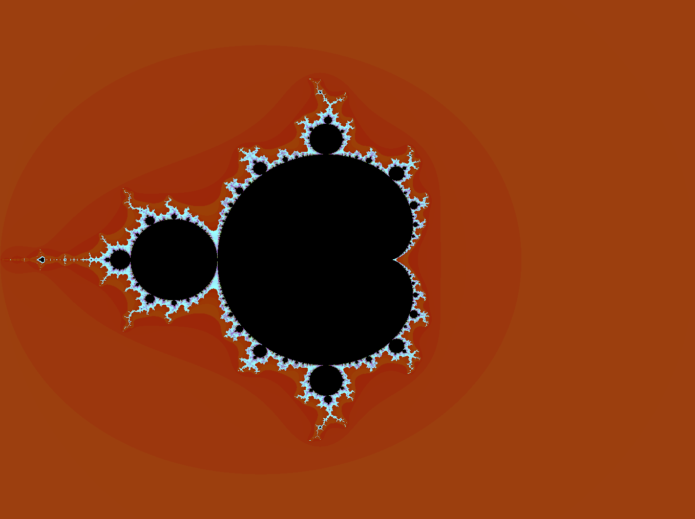

# FractalBot
Fractal creation tool made for a first year coursework.  
  
     
  
## Readme  
  
**I have implemented all the compulsory parts of the assignment. This includes:**  
* A complex number class.
* A panel that displays the mandelbrot set for given offsets and the ability to change the offsets.
* Change the iterations.
* Display the complex number represented by a click and the julia fractal for that number.
* Save a list of julia fractals as favourites (I have called these bookmarks), and the ability to remove from bookmarks.
* Zoom into a part of the mandelbrot fractal by dragging a box over that region.  
  
**I have also done a few extensions, which includes:**  
* Using threads to draw the fractal to prevent the program from freezing when a button is pressed.
* Display the time taken for the fractal to be fully drawn.
* Change the colour of the mandelbrot set by selecting a pre-set colour option from a combo box.
* A check box to zoom into the julia fractal as well when zooming on the mandelbrot fractal.
* An option to save the julia and mandelbrot fractals as a png file and choose the location of where to save.
* A combobox to select the type of fractal to be drawn. (I have added burning ship and mandelbrot squared).
* A "View Each Iteration" button which shows what the fractal looks like for each iteration until the specified amount, in an animation sort of way.